# SentinelOS

## Autonomous Linux Health Monitoring, Process Management & Self-Healing Platform

SentinelOS is a Linux-based system monitoring and recovery platform developed using **C++**, **Linux System Programming**, and **Linux Device Driver** concepts. The platform continuously monitors system resources, tracks running processes, gathers kernel-level information, and automatically detects and recovers from service failures to improve system reliability and availability.

This project is designed as an educational and practical implementation of Linux System Programming, Device Drivers, Networking, Process Management, and C++ concepts.

---

## 1. Problem Statement

Linux systems are widely used in embedded devices, servers, IoT gateways, and industrial systems. However, administrators often rely on multiple tools to monitor system health and manually recover failed services.

Common challenges include:

- High CPU or memory usage
- Process crashes and unexpected termination
- Lack of centralized monitoring
- Difficulty accessing kernel-level information
- Manual fault detection and recovery

SentinelOS aims to provide a unified monitoring and self-healing solution that automatically detects issues and assists in maintaining system stability.

---

## 2. Objectives

- Monitor CPU, memory, disk, and network utilization
- Monitor and manage Linux processes
- Retrieve and display kernel-level information
- Implement a Linux Character Device Driver
- Support client-server based remote monitoring
- Automatically detect and recover failed processes
- Generate logs and alerts for critical events

---

## 3. Key Features

### System Resource Monitoring
- CPU Usage Monitoring
- Memory Usage Monitoring
- Disk Usage Monitoring
- Network Statistics Monitoring

### Process Management
- Running Process Monitoring
- Process Status Tracking
- Process Information Retrieval
- Process Recovery Mechanism

### Kernel Information Monitoring
- Kernel Version Information
- System Information Collection
- Runtime System Statistics

### Device Driver Integration
- Custom Linux Character Device Driver
- User-Space to Kernel-Space Communication
- Device File Interface (`/dev/sentinel`)

### Client-Server Monitoring
- Remote System Monitoring
- TCP Socket Communication
- Real-Time Status Reporting

### Self-Healing Engine
- Failure Detection
- Automatic Process Restart
- Event Logging and Recovery Tracking

### Logging and Alerts
- System Event Logging
- Error Reporting
- Recovery Notifications

---

## 4. System Architecture

```text
+-----------------------------------+
|           SentinelOS              |
+-----------------------------------+
| Resource Monitoring Module        |
| Process Management Module         |
| Kernel Information Module         |
| Logging & Alert Module            |
| Self-Healing Recovery Module      |
| Client-Server Communication       |
+-----------------------------------+
                |
                v
+-----------------------------------+
| Character Device Driver           |
|        (/dev/sentinel)            |
+-----------------------------------+
                |
                v
+-----------------------------------+
| Linux Kernel                      |
+-----------------------------------+
```

---

## 5. Technology Stack

### Programming Language
- C++

### Operating System
- Linux (Ubuntu)

### Linux System Programming
- Processes
- Threads
- Signals
- IPC
- Shared Memory
- Semaphores
- Sockets

### Linux Device Drivers
- Kernel Modules
- Character Device Drivers
- User-Kernel Communication

### Development Tools
- GCC / G++
- Make
- Git
- GitHub
- GDB
- VS Code

---

## 6. Project Structure

```text
SentinelOS/
├── CMakeLists.txt
├── README.md
├── .gitignore
├── include/
│   ├── AlertManager.h
│   ├── KernelMonitor.h
│   ├── ProcessManager.h
│   ├── RecoveryManager.h
│   ├── ResourceMonitor.h
│   └── Server.h
├── src/
│   ├── AlertManager.cpp
│   ├── KernelMonitor.cpp
│   ├── ProcessManager.cpp
│   ├── RecoveryManager.cpp
│   ├── ResourceMonitor.cpp
│   ├── Server.cpp
│   └── main.cpp
├── client/
│   └── Client.cpp
├── driver/
│   ├── Makefile
│   └── sentinel_driver.c
└── docs/
    ├── Stage1_Project_Introduction.pdf
    ├── Stage2_Requirements_and_Design.pdf
    ├── Stage3_Implementation.pdf
    ├── Stage4_Testing.pdf
    ├── Stage5_Results.pdf
    └── Stage6_Final_Report.pdf
```

---

## 7. Applications

- Embedded Linux Systems
- Industrial Automation Systems
- IoT Gateways
- Small Linux Servers
- Educational Linux Labs
- System Administration Training

---

## 8. Development Roadmap

### Stage 1
- Project Introduction
- Problem Analysis
- Scope Definition

### Stage 2
- Requirements Analysis
- PRD Creation
- Development Planning

### Stage 3
- Architecture Design
- UML Diagrams
- Module Design

### Stage 4
- Prototype Development
- Resource Monitoring
- Process Monitoring

### Stage 5
- Testing & Integration
- Performance Improvements
- Documentation Updates

### Stage 6
- Final Implementation
- Device Driver Integration
- Client-Server Monitoring
- Final Presentation

---

# 9. Expected Output

The following screenshots demonstrate successful execution of SentinelOS.

## Server Startup & Connection

### System Summary
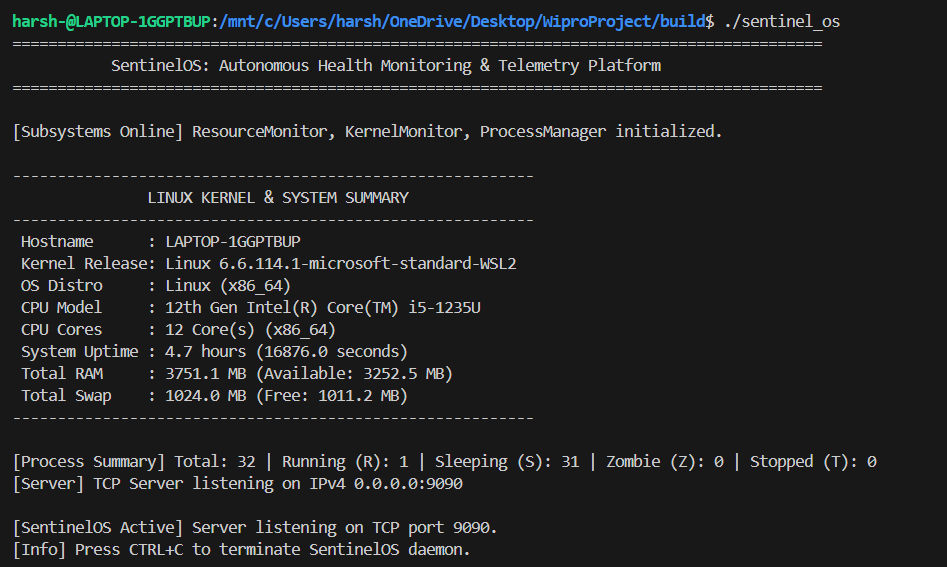

### Server Running
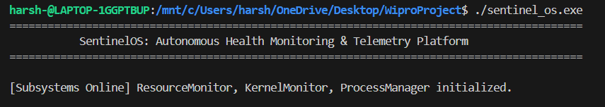

### Client Connected
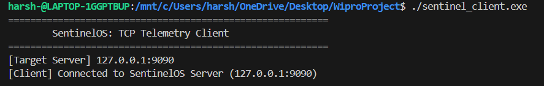

---

## Client Dashboard

### Dashboard Menu
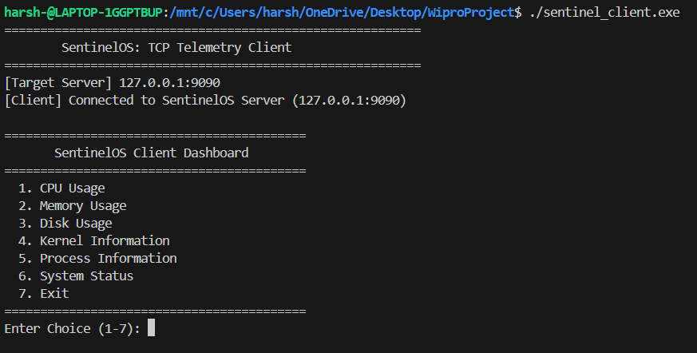

---

## Monitoring Features

### CPU Usage
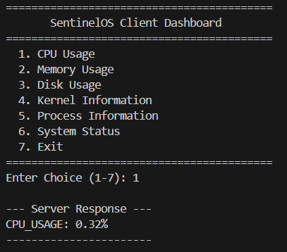

### Memory Usage
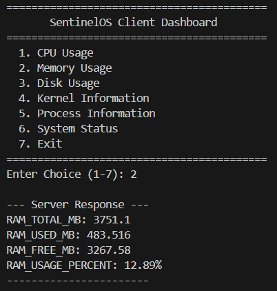

### Disk Usage
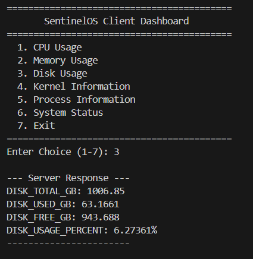

### Kernel Information
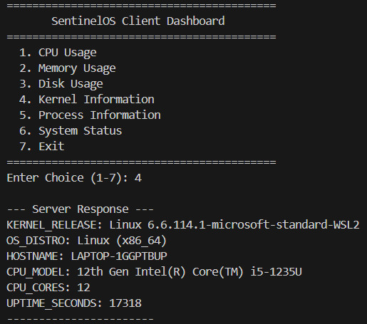

### Process Information
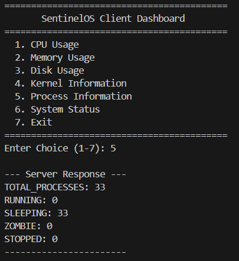

### System Status
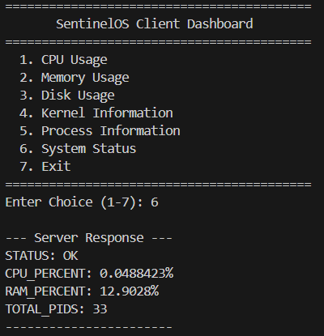

---

## Driver Build Verification

### Driver Build Success


---

## Program Exit

### Client Exit
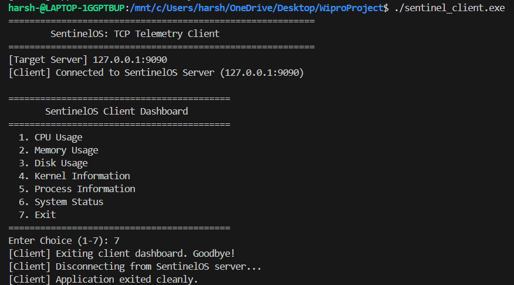

---
# 10. Quick Start

```bash
git clone <repository_url>
cd SentinelOS

make clean
make

./sentinel_os
```
## 11. Future Enhancements

- Web Dashboard
- Machine Learning-Based Failure Prediction
- Multi-System Monitoring
- Email and SMS Alerts
- Docker-Based Deployment
- Distributed Monitoring Architecture

---

# 12. Conclusion

SentinelOS is a Linux System Monitoring and Telemetry Platform developed using C++, Linux System Programming, TCP Socket Programming, and a Linux Character Device Driver. The platform continuously monitors system resource metrics including CPU, memory, disk, kernel, and process information. By supporting client-server communication, SentinelOS enables real-time telemetry and practical demonstration of key Linux system programming concepts, process management, and custom character device driver interactions.

---

---

## 13. Author

**Harshita Naik**  
B.Tech Computer Science & Engineering  
SOA University

---

## 14. License

This project is developed for educational and academic purposes.

