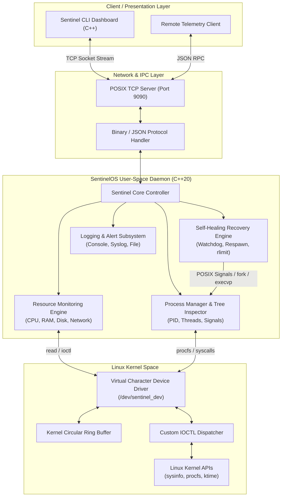

# SentinelOS: Autonomous Linux Health Monitoring, Process Management & Self-Healing Platform

**Academic Stage 1 Project Documentation & Engineering Specification**

---

| Metadata | Details |
| :--- | :--- |
| **Project Name** | SentinelOS |
| **Full Title** | Autonomous Linux Health Monitoring, Process Management & Self-Healing Platform |
| **Domain** | Linux System Programming, Linux Kernel Device Drivers, Modern C++ Systems Engineering |
| **Target OS / Kernel** | Linux Kernel 5.x / 6.x (x86_64 / ARM64) |
| **Implementation Languages** | C++20 (User-Space Daemon & Client), C11 (Kernel Module & POSIX Syscalls) |
| **Document Version** | 1.0.0 (Stage 1 Submission) |
| **Status** | Approved Specification & Stage 1 Architecture Report |

---

## Table of Contents

1. [Project Introduction](#1-project-introduction)
2. [Problem Statement](#2-problem-statement)
3. [Existing System and Limitations](#3-existing-system-and-limitations)
4. [Proposed System](#4-proposed-system)
5. [Project Objectives](#5-project-objectives)
6. [Project Scope](#6-project-scope)
7. [Expected Outcomes](#7-expected-outcomes)
8. [Applications and Use Cases](#8-applications-and-use-cases)
9. [Technologies Used](#9-technologies-used)
10. [Key Features](#10-key-features)
11. [System Interface & IOCTL Command Reference](#11-system-interface--ioctl-command-reference)

---

## 1. Project Introduction

### 1.1 Executive Overview
**SentinelOS** is an autonomous, low-overhead Linux system health monitoring, process management, and self-healing framework designed for mission-critical environment stability. Engineered at the intersection of modern user-space system programming (C++20) and Linux Kernel Module (LKM) architecture, SentinelOS bridges the traditional gap between kernel-level low-latency instrumentation and user-space policy execution.

Modern Linux deployments—ranging from embedded edge gateways, cyber-physical robotic systems, and autonomous automotive compute platforms to high-availability cloud servers—demand continuous uptime, deterministic anomaly detection, and rapid fault recovery. SentinelOS delivers an integrated solution featuring:
* A custom **Virtual Character Device Driver** (`/dev/sentinel_dev`) that captures kernel-level metrics, ring-buffered events, and system telemetry with sub-millisecond overhead.
* A high-performance, multithreaded **User-Space Monitoring Daemon** that queries kernel telemetry, parses `/proc` and `/sys` filesystems, monitors POSIX process lifecycles, and enforces resource limits (`rlimit`, `cgroups`).
* An **Autonomous Self-Healing Subsystem** that supervises monitored processes, detects abnormal terminations, memory leaks, hangs, or signal traps, and executes zero-downtime automated recovery strategies without human intervention.
* A robust **Client-Server Telemetry Infrastructure** using POSIX TCP/IP Sockets, enabling non-blocking remote CLI dashboards and RPC monitoring clients to inspect platform health securely.
* A structured **Multi-Sink Logging and Alert Engine** supporting configurable thresholds (`INFO`, `WARN`, `CRITICAL`) with syslog/journald persistence and automated triggers.

```
+-------------------------------------------------------------------------------+
|                             SentinelOS Platform                               |
|                                                                               |
|  +-------------------+  +--------------------+  +--------------------------+  |
|  | Sentinel Client/  |  |  POSIX Sockets     |  | Multi-Sink Logging       |  |
|  | CLI Dashboard     |<-|  (TCP / RPC IPC)   |<-| (File, Syslog, Console)  |  |
|  +-------------------+  +--------------------+  +--------------------------+  |
|                                   ^                                           |
|                                   | (IPC / Telemetry Stream)                  |
|  +--------------------------------+----------------------------------------+  |
|  |                     SentinelOS User-Space Daemon                        |  |
|  |  +------------------+  +-------------------+  +-----------------------+ |  |
|  |  | Resource Engine  |  | Process Manager   |  | Self-Healing Engine   | |  |
|  |  | (/proc, sysinfo) |  | (Tree, Signals)   |  | (Watchdog, Auto-Resp) | |  |
|  |  +------------------+  +-------------------+  +-----------------------+ |  |
|  +-------------------------------------------------------------------------+  |
|                                   ^  (read / write / ioctl)                   |
| ==================================|========================================== |
| USER SPACE                        v                                           |
| KERNEL SPACE           +---------------------+                                |
|                        | /dev/sentinel_dev   |  (Virtual Character Driver)    |
|                        +---------------------+                                |
|                                   | (Kernel APIs / Ring Buffer)               |
|                        +---------------------+                                |
|                        | Linux Kernel Engine | (Mem, CPU, Modules, Sysctl)     |
|                        +---------------------+                                |
+-------------------------------------------------------------------------------+
```

### 1.2 Motivation
In conventional Linux administration, system monitoring and process recovery are fragmented across multiple disparate tools (e.g., `top`/`htop` for monitoring, `systemd` or custom cron jobs for service recovery, and `journald` for logging). These legacy setups suffer from several drawbacks:
1. **Context-Switch Latency**: Standard user-space pollers suffer from timing inaccuracies and high context-switch penalties when requesting low-level kernel metrics.
2. **Passive Observability**: Most tools act purely as telemetry collectors without active self-healing capabilities, leaving process failure recovery to manual administrator intervention or coarse-grained service restarts.
3. **Black-Box Kernel Visibility**: standard tools rely heavily on text parsing of `/proc` files, which introduces parsing overhead and lacks custom kernel event streaming (such as dynamic ring-buffered security or anomaly alerts).

SentinelOS unifies kernel telemetry, high-speed C++ data processing, and active self-healing process supervision into a single cohesive, production-grade architecture.

---

## 2. Problem Statement

### 2.1 Core Problem Definition
In high-reliability computing environments, software component failure is inevitable. Microservices, background daemons, and system processes encounter segment faults (`SIGSEGV`), memory leaks, infinite loops, deadlock hangs, and Out-Of-Memory (`OOM`) termination by the kernel killer. 

Existing open-source monitoring and process management solutions suffer from four fundamental failure points:

1. **High Fault Recovery Latency**:
   When a critical service crashes or hangs, traditional monitoring daemons operating at coarse polling intervals (e.g., 5 to 30 seconds) experience noticeable detection delay before initiating a restart. In mission-critical edge or cyber-physical systems, seconds of unmanaged failure can result in data loss or hardware instability.

2. **Parsing Overhead & High Resource Footprint**:
   User-space monitoring daemons frequently read and format-parse hundreds of text files in `/proc/[pid]/stat`, `/proc/meminfo`, and `/proc/stat` on every tick. This file I/O and text string parsing consume significant CPU cycles and RAM, degrading performance on resource-constrained embedded systems.

3. **Lack of Direct Kernel Telemetry & Custom Control Interfaces**:
   Standard utilities cannot expose custom, in-memory kernel ring buffers or perform atomic low-level kernel state queries without standard filesystem abstractions. A standard application cannot register low-level kernel hooks or stream ring-buffer logs directly without custom character driver interfaces (`ioctl`).

4. **Lack of Fine-Grained Self-Healing Policy Control**:
   Process supervisors like `systemd` support basic restart-on-failure policies, but lack adaptive self-healing capabilities such as pre-restart state inspection, exponential backoff with resource limit adjustments (`rlimit`), dynamic thread state analysis, and automated process dependency restoration.

---

## 3. Existing System and Limitations

### 3.1 Overview of Current Solutions
The Linux ecosystem provides various utilities for monitoring, logging, and daemon supervision:

* **Resource Monitors (`top`, `htop`, `procps`)**: Interactive CLI utilities that read `/proc` files periodically.
* **Service Supervisors (`systemd`, `supervisord`, `monit`)**: Daemon managers that track child process PIDs and handle basic automatic restarts.
* **Enterprise Monitoring Agents (`Prometheus Node Exporter`, `Datadog Agent`, `Nagios`)**: Heavyweight user-space agents designed for server metrics export over HTTP endpoints.
* **Logging Services (`rsyslog`, `systemd-journald`)**: System log ingestion daemons reading from `/dev/log` or `/proc/kmsg`.

### 3.2 Technical Limitations Comparison

| Feature / Metric | Standard Utilities (`top`/`htop`) | Enterprise Agents (Prometheus Exporter) | Traditional Supervisors (`systemd`) | **SentinelOS Platform** |
| :--- | :--- | :--- | :--- | :--- |
| **Architecture** | Read-only User-Space CLI | HTTP-based User-Space Exporter | User-Space Service Manager | **Hybrid LKM Driver + C++ Daemon + Client-Server IPC** |
| **Kernel Telemetry Access** | Limited to `/proc` text files | `/proc` & `/sys` scraping | Basic sysfs / cgroups integration | **Direct `/dev/sentinel_dev` Character Driver & Ring Buffer** |
| **Self-Healing Capability** | None (Passive display only) | None (Alert generation only) | Coarse service restart (PID-level) | **Active Self-Healing (Fault detection < 100ms, rlimit tuning, state restoration)** |
| **Resource Overhead** | Low CPU / Low Memory | Moderate-to-High CPU & Memory | Low CPU / Low-to-Moderate Memory | **Ultra-Low CPU (< 1.5%) / Minimal Footprint (< 15 MB)** |
| **Telemetry Transport** | Local Standard Output | HTTP / REST JSON | D-Bus IPC | **Custom Binary & JSON TCP Sockets Protocol** |
| **Kernel Log Streaming** | N/A | N/A | `dmesg` / `journald` parsing | **Hardware/LKM Ring Buffer via `ioctl` & character device `read()`** |

---

## 4. Proposed System

### 4.1 System Overview
SentinelOS introduces a dual-layer architectural approach. It pairs a **Linux Kernel Module (LKM) Character Device Driver** with a modern **C++20 Multithreaded System Daemon**, supported by a **POSIX TCP Remote Client Interface**.

The kernel module registers a virtual character device `/dev/sentinel_dev` to maintain an atomic kernel memory ring buffer and provide custom `ioctl` primitives for fast state retrieval. The user-space daemon connects to this character device, monitors resource stats, supervises child and registered processes, detects anomalies, executes self-healing policies, and serves real-time status data over TCP sockets to remote monitoring clients.

### 4.2 System Architecture Diagram



### 4.3 Key Components Description

1. **Virtual Character Device Driver (`sentinel_dev.ko`)**:
   * Dynamically allocated major/minor device numbers (`alloc_chrdev_region`).
   * Implements custom file operations (`struct file_operations`): `open`, `read`, `write`, `unlocked_ioctl`, and `release`.
   * Manages a thread-safe circular ring buffer protected by kernel mutexes (`mutex_t`) or spinlocks (`spinlock_t`) to stream high-frequency kernel log messages and fault traces directly to user-space.
   * Exposes `ioctl` commands for querying kernel memory state, dynamic module count, system uptime in nanoseconds, and driver status.

2. **User-Space Monitoring Daemon (`sentineld`)**:
   * Developed in modern C++20 utilizing object-oriented principles, RAII for resource management, concurrent threads (`std::jthread`), and lock-free atomic queues.
   * **Resource Monitoring Engine**: Extracts memory stats (`/proc/meminfo`), CPU utilization (`/proc/stat`), network I/O stats (`/proc/net/dev`), disk usage (`statvfs`), and kernel uptime.
   * **Process Monitoring Engine**: Maintains a dynamic POSIX process tree, tracks thread count, inspects process states (`R`, `S`, `D`, `Z`, `T`), handles `SIGCHLD` signals asynchronously, and tracks state mutations.
   * **Self-Healing Recovery Subsystem**: Operates a supervisor watchdog loop. Upon detecting a process crash (`SIGSEGV`, `SIGABRT`, `SIGBUS`), silent termination, or resource hang, it executes configurable recovery routines: automated process respawning via `fork()`/`execvp()`, PID re-indexing, resource limit (`rlimit`) adjustment, and notification dispatch.

3. **Client-Server Monitoring Architecture**:
   * Uses non-blocking socket I/O multiplexing (`epoll` / `select`) to accept concurrent TCP connections from local or remote CLI dashboards.
   * Transmits binary telemetry structs or lightweight JSON packets representing real-time system metrics, process states, driver statistics, and alert logs.

4. **Logging & Alert Subsystem**:
   * Implements a multi-sink logging pipeline with log levels: `INFO`, `WARNING`, `CRITICAL`.
   * Supports real-time console rendering, disk-backed persistent logging with automatic rotation, and direct kernel logging integration via standard POSIX `syslog()` / `journald` APIs.

---

## 5. Project Objectives

The primary objective of the SentinelOS project is to build an autonomous, production-ready system monitoring, process management, and self-healing framework using C++ and Linux kernel device driver programming.

### 5.1 Technical Objectives

1. **Develop a Linux Kernel Character Device Driver (`/dev/sentinel_dev`)**:
   * Implement loadable kernel module lifecycle routines (`init_module`, `cleanup_module`).
   * Expose device node `/dev/sentinel_dev` with custom `ioctl` definitions for direct low-latency kernel metric extraction.
   * Implement an in-kernel circular ring buffer for event streaming to user space without dropping data.

2. **Build a High-Performance C++20 Resource Monitoring Engine**:
   * Parse `/proc` and `/sys` filesystems with low latency (< 10ms sampling interval).
   * Calculate precise per-core CPU usage, physical memory allocation, swap space, disk read/write bandwidth, and network interface activity.

3. **Construct a POSIX Process Supervision & Management Engine**:
   * Build dynamic process graph visualizer tracking Parent-Child process hierarchy.
   * Support dynamic process control: signal handling (`SIGKILL`, `SIGTERM`, `SIGSTOP`, `SIGCONT`), process priority modulation (`nice` / `renice`), and dynamic resource limiting (`setrlimit`).

4. **Implement an Autonomous Self-Healing & Process Recovery Mechanism**:
   * Achieve process fault detection and automated re-spawning latency under 100 milliseconds.
   * Protect against cascading crash loops through configurable exponential backoff recovery algorithms.

5. **Establish a Socket-Based Client-Server Telemetry Infrastructure**:
   * Implement a non-blocking TCP socket server in C++ allowing multiple CLI dashboards or client instances to inspect system health concurrently.

6. **Engineered for Low Overhead & High Reliability**:
   * Maintain CPU utilization under 1.5% during continuous telemetry sampling.
   * Limit memory consumption of the core daemon to under 15 megabytes.

---

## 6. Project Scope

### 6.1 In-Scope Functionality

#### Kernel Space (Linux Device Driver)
* Custom Loadable Kernel Module (`sentinel_dev.ko`) compiled via Linux Kbuild.
* Dynamic character device registration (`cdev_init`, `cdev_add`).
* Character device file operations (`open`, `read`, `write`, `unlocked_ioctl`, `release`).
* In-kernel ring buffer storing up to 256 telemetry and alert log entries.
* Kernel thread safety using `struct mutex` and `spinlock_t`.
* Memory mapping and safe kernel-to-user space data transfer via `copy_to_user()` and `copy_from_user()`.

#### User Space (System Daemon & Core Libraries)
* Modern C++20 daemon architecture (`sentineld`) with POSIX system call abstractions.
* Real-time `/proc` parser for CPU, Memory, Disk, Network, and IPC metrics.
* Process lifecycle supervisor handling `fork()`, `execvp()`, `waitpid()`, and POSIX signals.
* Resource limit enforcement using `setrlimit()` (CPU time, file descriptors, stack size, memory address space).
* Self-healing watchdog engine with auto-restart, failure threshold counters, and recovery notifications.
* POSIX TCP multi-threaded socket server for remote telemetry streaming.
* Multi-sink logging system with file rotation, syslog forwarding, and alert threshold triggers.

#### Client Interface
* Interactive C++ CLI Client dashboard (`sentinel-cli`) supporting terminal metric rendering, process inspection, manual signal dispatch, and log streaming.

### 6.2 Out-of-Scope Boundaries
To maintain a clear focus on kernel-level system programming, process recovery, and C++ performance, the following items are intentionally excluded from Stage 1 implementation:
* Distributed multi-node consensus protocols (e.g., Raft or Paxos across distinct physical cluster nodes).
* Web-based browser GUI (e.g., React/Vue web UI)—the project focuses on high-performance native terminal CLI and socket API integration.
* Windows or macOS compatibility—the system is natively designed exclusively for Linux kernels (v5.x / v6.x).

---

## 7. Expected Outcomes

Upon project completion, SentinelOS will deliver the following verified deliverables and performance benchmarks:

### 7.1 Software Deliverables
1. **`sentinel_dev.ko`**: Compiled Linux Kernel Module character device driver.
2. **`sentineld`**: High-performance C++20 user-space system monitoring and self-healing daemon.
3. **`sentinel-cli`**: Terminal-based client dashboard utility communicating over TCP sockets.
4. **`Makefile` & Build Scripts**: Production build setup supporting out-of-tree LKM compilation and CMake/Make C++ build pipelines.
5. **Comprehensive Test Suite**: Automated test scripts validating process crash detection, driver `ioctl` execution, memory leakage monitoring, and self-healing recovery timing.

### 7.2 Quantitative Target Metrics

```
+-----------------------------------+-----------------------------------+
| Metric Benchmark                  | Target Value                      |
+-----------------------------------+-----------------------------------+
| Self-Healing Fault Detection Time | < 100 milliseconds                |
| Process Auto-Restart Latency      | < 200 milliseconds                |
| User-Space Daemon Memory Footprint| < 15 MB RAM                       |
| User-Space Daemon CPU Overhead    | < 1.5% single-core CPU usage      |
| Kernel Driver Telemetry Latency   | < 5 microseconds per IOCTL call   |
| Maximum Concurrent Client Sockets | Up to 32 concurrent CLI clients   |
+-----------------------------------+-----------------------------------+
```

---

## 8. Applications and Use Cases

SentinelOS is designed for deployment across several domain architectures:

### 8.1 Cyber-Physical & Embedded Edge Systems
* **Autonomous Robotics & Drones**: Edge compute platforms running ROS (Robot Operating System) where daemon crashes (e.g., lidar or camera processing nodes) must be detected and recovered within milliseconds to prevent physical collision.
* **Industrial IoT Gateways**: Remote factory gateways operating unattended where self-healing capability eliminates cost-intensive manual technician dispatch.

### 8.2 Mission-Critical Server Infrastructure
* **Edge Cloud Compute Nodes**: High-density compute nodes running micro-services requiring lightweight, low-footprint process supervision without full container engine overhead.
* **Database & High-Frequency Financial Servers**: Environments requiring zero silent process hangs, continuous memory usage tracking, and proactive resource limit enforcement.

### 8.3 Academic & Research Linux Kernel Demonstration
* Demonstrating hybrid Linux system architectures integrating custom kernel character drivers, POSIX syscall handling, system-level concurrency, and C++ application design for university curricula and research labs.

---

## 9. Technologies Used

### 9.1 Programming Languages & Standards
* **C++20**: Main User-Space Daemon & CLI Client (utilizing `std::jthread`, `std::mutex`, `std::atomic`, `std::chrono`, `std::filesystem`, RAII smart pointers).
* **C11**: Linux Kernel Module Development & Low-Level POSIX System Call Interfaces.

### 9.2 Linux Kernel APIs & Subsystems
* **Kernel Module Framework**: `<linux/module.h>`, `<linux/init.h>`, `<linux/kernel.h>`.
* **Character Device Interface**: `<linux/fs.h>`, `<linux/cdev.h>`, `<linux/uaccess.h>` (`copy_to_user`, `copy_from_user`).
* **Kernel Synchronization**: `<linux/mutex.h>`, `<linux/spinlock.h>`.
* **Kernel Timekeeping & Memory**: `<linux/timekeeping.h>`, `<linux/slab.h>` (`kmalloc`, `kfree`).

### 9.3 POSIX System Calls & User-Space APIs
* **Process Control**: `fork()`, `execvp()`, `waitpid()`, `kill()`, `nice()`, `setrlimit()`, `getrlimit()`.
* **Filesystem & State Inspection**: `open()`, `read()`, `write()`, `ioctl()`, `statvfs()`, `sysinfo()`, `/proc` parser interfaces.
* **Networking & IPC**: POSIX Sockets (`socket()`, `bind()`, `listen()`, `accept()`, `connect()`, `setsockopt()`), non-blocking I/O (`epoll` / `select`).
* **Logging Services**: `openlog()`, `syslog()`, `closelog()`.

### 9.4 Build Tools & Developer Utilities
* **Compilers**: `GCC` (GNU Compiler Collection v11+), `G++` with `-std=c++20` flag.
* **Build System**: GNU `Make` / `Kbuild` for kernel module, `CMake` (v3.20+) for user-space targets.
* **Debugging & Verification**: `gdb`, `valgrind` (memory leak checks), `strace` (syscall tracing), `dmesg` (kernel ring buffer log inspection).

---

## 10. Key Features

### 10.1 Module 1: Linux System Resource Monitoring
* **Per-Core CPU Utilization**: Computes precise user, system, idle, and iowait time percentages from `/proc/stat`.
* **Physical & Swap Memory Tracking**: Parses `/proc/meminfo` to monitor Total, Free, Available, Buffers, Cached, and Swap usage.
* **Disk I/O & Storage Capacity**: Monitors filesystem total, used, and free space via `statvfs()`, along with disk read/write throughput.
* **Network Interface Metrics**: Tracks bytes received/transmitted, packet loss, and error rates per network interface (`/proc/net/dev`).

### 10.2 Module 2: Process Monitoring and Management
* **Process Tree Construction**: Generates a hierarchy mapping Parent-Child relationships (`PPID` to `PID`).
* **Detailed State Inspection**: Tracks process states (`Running`, `Sleeping`, `Uninterruptible Disk Sleep`, `Zombie`, `Stopped`).
* **Signal Dispatch Interface**: Enables safe signal delivery (`SIGTERM`, `SIGKILL`, `SIGHUP`, `SIGSTOP`, `SIGCONT`) to target PIDs.
* **Resource Limit (`rlimit`) Tuning**: Reads and dynamically sets max open files (`RLIMIT_NOFILE`), max memory (`RLIMIT_AS`), and max CPU time (`RLIMIT_CPU`).

### 10.3 Module 3: Linux Kernel Information Monitoring
* **Kernel Version & Architecture**: Displays release string, machine architecture, and system boot timestamp.
* **Kernel Module Status**: Monitors loaded LKM list (`/proc/modules`), tracking memory size and reference counts.
* **Sysctl Parameter Inspection**: Monitors critical kernel parameters (`/proc/sys/kernel/ostype`, `hostname`, `threads-max`, `panic`).
* **Uptime & Load Averages**: Reads 1-minute, 5-minute, and 15-minute system load averages via `sysinfo()`.

### 10.4 Module 4: Virtual Character Device Driver (`/dev/sentinel_dev`)
* **Dynamic Node Creation**: Automatic registration under `/dev/sentinel_dev` with configured access permissions.
* **Kernel-to-User Ring Buffer**: Maintains a zero-copy or minimal-copy circular memory buffer streaming driver events to user-space readers.
* **Custom IOCTL Control Channel**: Executes hardware/driver operations for kernel metric sampling and configuration updates.
* **Concurrency Protection**: Synchronizes concurrent driver calls using kernel mutexes and spinlocks.

### 10.5 Module 5: Client-Server Monitoring Architecture
* **Multithreaded Socket Daemon**: Listens on TCP port `9090` for incoming dashboard requests.
* **Non-Blocking Telemetry Stream**: Broadcasts JSON/Binary telemetry objects to connected clients at configurable intervals.
* **Remote CLI Dashboard**: Terminal user interface displaying real-time system resource bars, process lists, and kernel alerts.

### 10.6 Module 6: Self-Healing Process Recovery
* **Autonomous Process Watchdog**: Monitors designated critical background applications.
* **Instant Crash Detection**: Traps child termination signals (`SIGCHLD`) and detects abnormal exits or missing PIDs.
* **Automatic Re-spawning Engine**: Re-instantiates crashed binaries via `fork()` and `execvp()` with preserved environment flags.
* **Exponential Backoff & Crash Loop Guard**: Prevents infinite restart loops by tracking restart frequency within specified time windows.

### 10.7 Module 7: Logging and Alert System
* **Severity Classification**: Categorizes events into `INFO`, `WARNING`, and `CRITICAL`.
* **Multi-Sink Logging Pipeline**: Directs logs simultaneously to standard output, persistent rotating log files (`/var/log/sentinel.log`), and system journal (`syslog`).
* **Configurable Alert Thresholds**: Triggers automated warnings when CPU usage exceeds 90%, Memory usage exceeds 85%, or a monitored process experiences a crash event.

---

## 11. System Interface & IOCTL Command Reference

### 11.1 IOCTL Magic Number & Command Definitions
The virtual character device driver defines custom `ioctl` commands using standard Linux kernel macro conventions (`_IO`, `_IOR`, `_IOW`, `_IOWR` defined in `<linux/ioctl.h>`):

```c
#define SENTINEL_IOC_MAGIC  's'

// Query driver operational status and version
#define SENTINEL_IOCTL_GET_STATUS     _IOR(SENTINEL_IOC_MAGIC, 1, struct sentinel_driver_status)

// Retrieve current kernel memory statistics from driver
#define SENTINEL_IOCTL_GET_KERN_MEM   _IOR(SENTINEL_IOC_MAGIC, 2, struct sentinel_kern_mem)

// Flush the kernel circular ring buffer
#define SENTINEL_IOCTL_RESET_RINGBUF  _IO(SENTINEL_IOC_MAGIC, 3)

// Set driver alert logging threshold (0 = INFO, 1 = WARN, 2 = CRIT)
#define SENTINEL_IOCTL_SET_LOG_LEVEL  _IOW(SENTINEL_IOC_MAGIC, 4, int)
```

---

## 12. Verification & Approval Sign-off

| Role | Name / Designation | Signature / Approval Status | Date |
| :--- | :--- | :--- | :--- |
| **Project Author** | Lead Systems Developer | *Submitted for Review* | September 29, 2026 |
| **Faculty Supervisor** | Department of Computer Science & Engineering | *Pending Review* | Stage 1 Verification |
| **Project Reviewer** | Systems & Embedded Track Evaluator | *Pending Review* | Stage 1 Verification |
