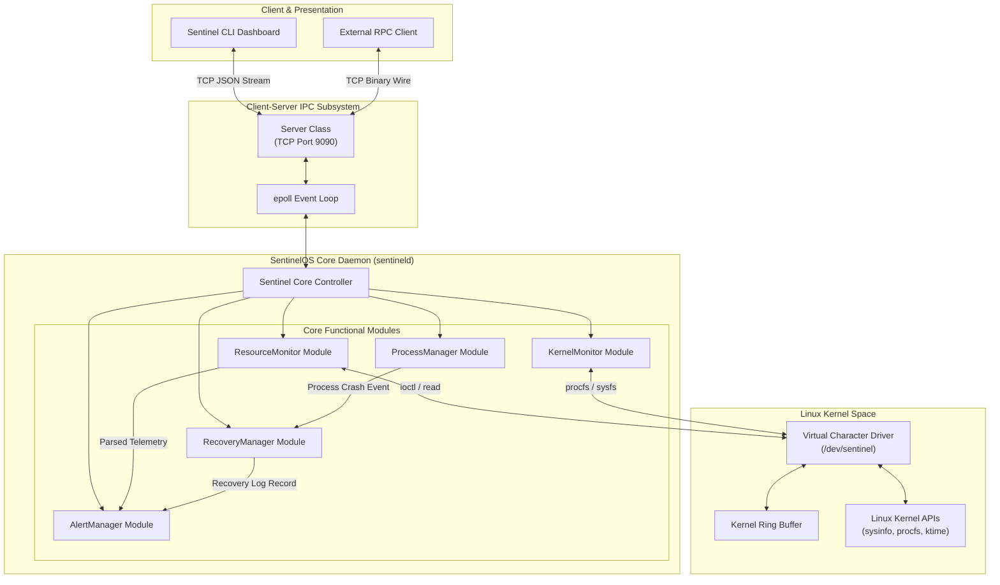
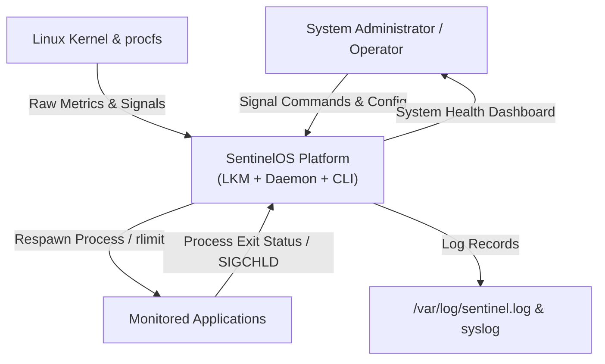
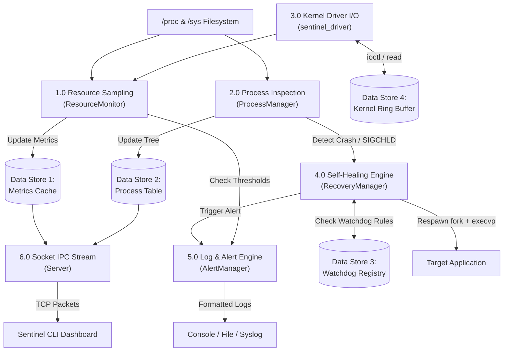
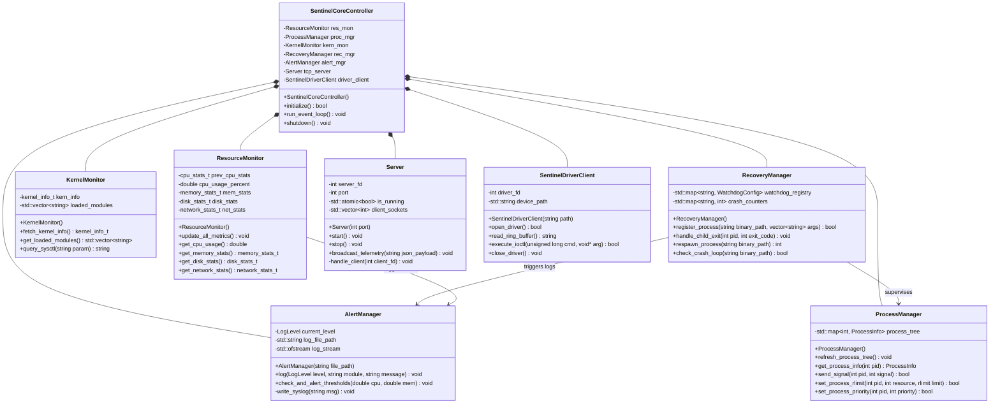
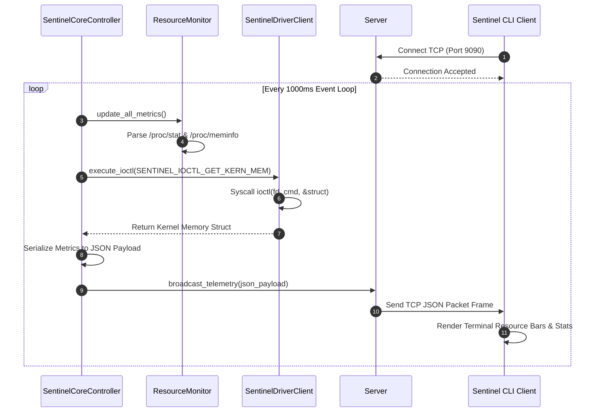
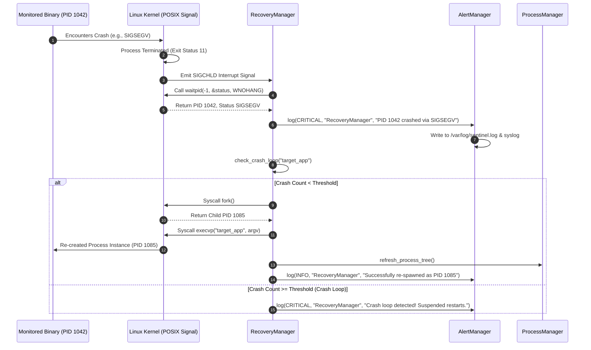
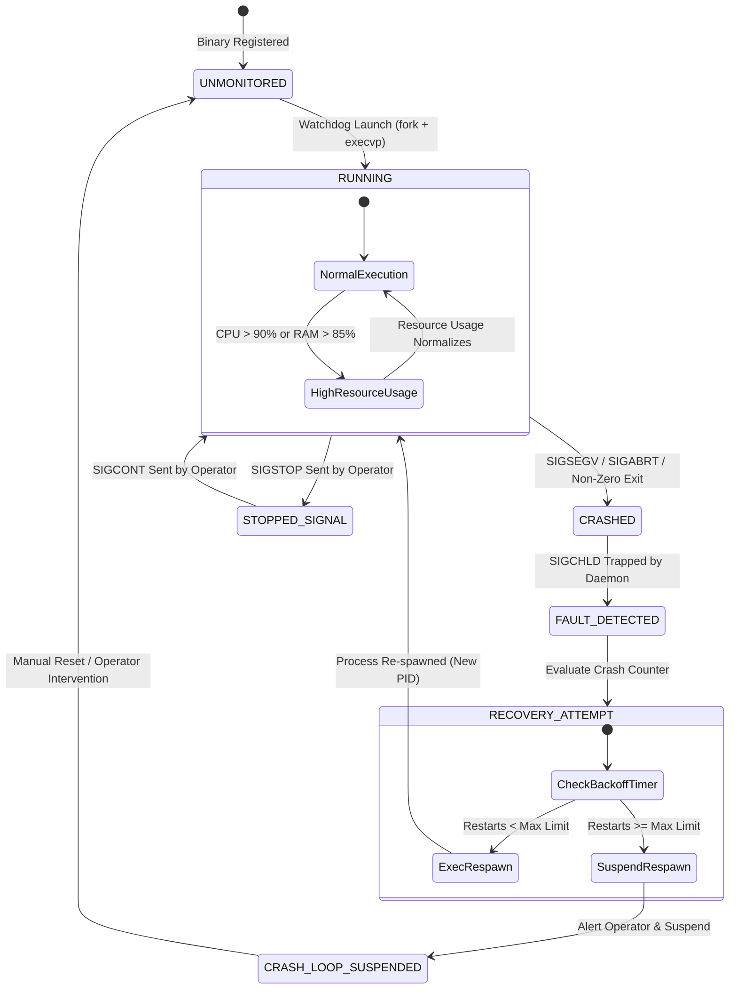

# SentinelOS: Autonomous Linux Health Monitoring, Process Management & Self-Healing Platform

**Academic Stage 3 Project Documentation & System Architecture Specification**

---

| Metadata | Details |
| :--- | :--- |
| **Project Name** | SentinelOS |
| **Full Title** | Autonomous Linux Health Monitoring, Process Management & Self-Healing Platform |
| **Author** | Harshita Naik (B.Tech Computer Science & Engineering, SOA University) |
| **Document Type** | System Architecture, Component Design & UML Specification (Stage 3) |
| **Target OS / Kernel** | Linux Kernel 5.x / 6.x (x86_64 / ARM64) |
| **Implementation Languages** | C++20 (User-Space Daemon & Client), C11 (Kernel Module & POSIX Syscalls) |
| **Document Version** | 3.0.0 (Stage 3 Submission) |
| **Status** | Approved Architectural Specification & Design Blueprint |

---

## Table of Contents

1. [High-Level Architecture](#1-high-level-architecture)
2. [Component Architecture](#2-component-architecture)
3. [Data Flow Diagrams (DFD)](#3-data-flow-diagrams-dfd)
4. [UML Class Diagram](#4-uml-class-diagram)
5. [UML Sequence Diagrams](#5-uml-sequence-diagrams)
6. [UML State Machine Diagram](#6-uml-state-machine-diagram)
7. [Component Responsibilities](#7-component-responsibilities)
8. [Data Structures Required](#8-data-structures-required)
9. [C++ Class Design](#9-c-class-design)
10. [Linux Driver Architecture](#10-linux-driver-architecture)
11. [Client-Server Communication Design](#11-client-server-communication-design)
12. [Implementation Plan & Git Hierarchy](#12-implementation-plan--git-hierarchy)

---

## 1. High-Level Architecture

SentinelOS adopts a multi-tiered, hybrid architecture bridging Linux Kernel Space and User Space. The architecture isolates low-level hardware instrumentation in a Loadable Kernel Module (LKM) while executing complex analysis, process supervision, multi-threading, and TCP network telemetry inside a modern C++20 user-space daemon.

```
+---------------------------------------------------------------------------------------------------+
|                                      PRESENTATION & CLIENT LAYER                                  |
|  +---------------------------------------------------+  +--------------------------------------+  |
|  | Sentinel CLI Dashboard (C++ Terminal UI)          |  | Remote RPC / Telemetry Clients       |  |
|  +---------------------------------------------------+  +--------------------------------------+  |
+---------------------------------------------------|-----------------------------------------------+
                                                    | (TCP Sockets - Port 9090)
+---------------------------------------------------|-----------------------------------------------+
|                                      NETWORK & IPC LAYER                                          |
|  +---------------------------------------------------------------------------------------------+  |
|  | Non-Blocking TCP Socket Server (epoll / Thread-Pool Event Loop)                            |  |
|  | Protocol Parser (Binary Packet Headers / Serialized JSON Data Streams)                      |  |
|  +---------------------------------------------------------------------------------------------+  |
+---------------------------------------------------|-----------------------------------------------+
                                                    | (Internal C++ Event Bus & Shared State)
+---------------------------------------------------|-----------------------------------------------+
|                                  USER-SPACE DAEMON LAYER (sentineld)                              |
|  +---------------------------+  +--------------------------+  +--------------------------------+  |
|  | Resource Monitoring Engine|  | Process Management Engine|  | Self-Healing Watchdog Engine   |  |
|  | (/proc, sysinfo, statvfs) |  | (Tree, Signals, rlimit)  |  | (SIGCHLD Trap, Respawn Engine) |  |
|  +---------------------------+  +--------------------------+  +--------------------------------+  |
|  +---------------------------+  +--------------------------+                                      |
|  | Kernel Information Engine |  | Multi-Sink Alert Engine  |                                      |
|  | (/proc/modules, sysctl)   |  | (File, Syslog, Console)  |                                      |
|  +---------------------------+  +--------------------------+                                      |
+---------------------------------------------------|-----------------------------------------------+
                                                    | (read / write / ioctl)
====================================================|================================================
|                                      LINUX KERNEL SPACE                                           |
|  +---------------------------------------------------------------------------------------------+  |
|  | Virtual Character Device Driver (/dev/sentinel)                                             |  |
|  |   - Device Node Registration (cdev_add / alloc_chrdev_region)                               |  |
|  |   - In-Kernel Circular Ring Buffer (Lock-Free / Spinlock Protected)                         |  |
|  |   - Custom IOCTL Control Handler (unlocked_ioctl)                                           |  |
|  |   - Kernel Subsystem APIs (sysinfo, ktime, kmalloc, copy_to_user)                           |  |
|  +---------------------------------------------------------------------------------------------+  |
+---------------------------------------------------------------------------------------------------+
```

### 1.1 Simplified Subsystem Overview for Presentation & Viva

For high-level project walkthroughs and Viva defense, the platform is summarized into 3 primary functional tiers:

1. **User-Space Monitoring Daemon (`sentinel_os`)**:
   - Compiles with modern C++20 (`-std=c++20`).
   - Reads system telemetry from POSIX `/proc` files (`/proc/stat`, `/proc/meminfo`, `/proc/uptime`).
   - Manages child processes, traps unexpected exits via `waitpid()`, and re-spawns failed daemons.

2. **Linux Character Device Driver (`/dev/sentinel`)**:
   - Written in C11 (`sentinel_driver.c`).
   - Registers character device node `/dev/sentinel` using `alloc_chrdev_region()` and `cdev_add()`.
   - Handles binary control requests via `ioctl()` and safely transfers data using `copy_to_user()`.

3. **Remote CLI Monitoring Client (`sentinel_client`)**:
   - C++ terminal client connecting to `sentinel_os` via TCP Socket (port 9090).
   - Issues query requests (`GET_CPU`, `GET_MEMORY`, `GET_PROCESSES`) and displays live system metrics.

---

## 2. Component Architecture

The component architecture defines module bindings, data interfaces, and execution loops across the 7 sub-systems.



---

## 3. Data Flow Diagrams (DFD)

### 3.1 DFD Level 0 (Context Diagram)



### 3.2 DFD Level 1 (Detailed Subsystem Data Flow)



---

## 4. UML Class Diagram

The UML Class Diagram models object-oriented relationships, inheritance, compositions, and method signatures across the system.



---

## 5. UML Sequence Diagrams

### 5.1 Real-Time Telemetry & Metric Broadcast Sequence



### 5.2 Self-Healing Process Failure & Recovery Sequence



---

## 6. UML State Machine Diagram

State Machine depicting the lifecycle transitions of a Monitored Application under SentinelOS supervision.



---

## 7. Component Responsibilities

| Subsystem Component | Core Design Pattern | Key Responsibilities | Primary API / Syscall Dependencies |
| :--- | :--- | :--- | :--- |
| **ResourceMonitor** | Facade Pattern | Samples per-core CPU usage, RAM/Swap allocation, disk space, and network interface metrics. | `/proc/stat`, `/proc/meminfo`, `statvfs()`, `/proc/net/dev` |
| **ProcessManager** | Composite Pattern | Scans POSIX process tree, tracks process states (`R`/`S`/`Z`), dispatches signals, and sets resource limits (`rlimit`). | `/proc/[pid]/stat`, `kill()`, `nice()`, `setrlimit()` |
| **KernelMonitor** | Observer Pattern | Monitors loaded LKMs, queries kernel version info, uptime, load averages, and sysctl parameters. | `sysinfo()`, `/proc/modules`, `/proc/sys/kernel/` |
| **Virtual Character Driver** | Bridge Pattern (User/Kernel) | In-kernel character device `/dev/sentinel`, ring buffer log streaming, and custom `ioctl` commands. | `cdev_add()`, `copy_to_user()`, `unlocked_ioctl()`, spinlocks |
| **Server & Client IPC** | Reactor / Thread Pool Pattern | Operates non-blocking TCP socket server (port 9090) and interactive terminal CLI dashboard. | `socket()`, `bind()`, `listen()`, `accept()`, `epoll` |
| **RecoveryManager** | Watchdog / Active Supervisor | Traps `SIGCHLD` signals, evaluates exit codes, executes process re-spawning, and enforces crash-loop backoff. | `signal()`, `SIGCHLD`, `waitpid()`, `fork()`, `execvp()` |
| **AlertManager** | Chain of Responsibility / Logger | Multi-sink logging pipeline routing messages to stdout, file, and `syslog` based on log severity thresholds. | `std::ofstream`, `openlog()`, `syslog()`, `closelog()` |

---

## 8. Data Structures Required

### 8.1 System Resource Structs (`include/ResourceTypes.h`)

```cpp
#ifndef RESOURCE_TYPES_H
#define RESOURCE_TYPES_H

#include <string>
#include <vector>
#include <cstdint>

struct CpuTicks {
    uint64_t user{0};
    uint64_t nice{0};
    uint64_t system{0};
    uint64_t idle{0};
    uint64_t iowait{0};
    uint64_t irq{0};
    uint64_t softirq{0};
    uint64_t steal{0};
};

struct CpuStats {
    double overall_usage_percent{0.0};
    std::vector<double> per_core_usage;
};

struct MemoryStats {
    uint64_t total_ram_mb{0};
    uint64_t free_ram_mb{0};
    uint64_t available_ram_mb{0};
    uint64_t total_swap_mb{0};
    uint64_t free_swap_mb{0};
    double ram_usage_percent{0.0};
};

struct DiskStats {
    uint64_t total_space_gb{0};
    uint64_t free_space_gb{0};
    uint64_t used_space_gb{0};
    double disk_usage_percent{0.0};
};

struct NetworkStats {
    std::string interface_name;
    uint64_t rx_bytes{0};
    uint64_t tx_bytes{0};
    uint64_t rx_errors{0};
    uint64_t tx_errors{0};
};

#endif // RESOURCE_TYPES_H
```

### 8.2 Kernel Driver Data Structures (`driver/sentinel_ioctl.h`)

```c
#ifndef SENTINEL_IOCTL_H
#define SENTINEL_IOCTL_H

#include <linux/ioctl.h>

#define SENTINEL_IOC_MAGIC 's'

struct sentinel_driver_status {
    unsigned int driver_version;
    unsigned int ring_buffer_head;
    unsigned int ring_buffer_tail;
    unsigned int total_events_logged;
};

struct sentinel_kern_mem {
    unsigned long total_kernel_ram;
    unsigned long free_kernel_ram;
    unsigned long total_high_mem;
    unsigned long free_high_mem;
    unsigned int active_module_count;
};

#define SENTINEL_IOCTL_GET_STATUS    _IOR(SENTINEL_IOC_MAGIC, 1, struct sentinel_driver_status)
#define SENTINEL_IOCTL_GET_KERN_MEM  _IOR(SENTINEL_IOC_MAGIC, 2, struct sentinel_kern_mem)
#define SENTINEL_IOCTL_RESET_RINGBUF _IO(SENTINEL_IOC_MAGIC, 3)
#define SENTINEL_IOCTL_SET_LOG_LEVEL _IOW(SENTINEL_IOC_MAGIC, 4, int)

#endif // SENTINEL_IOCTL_H
```

---

## 9. C++ Class Design

Detailed C++ class header interfaces enforcing RAII, modern C++20 standard library primitives, and strict encapsulation.

### 9.1 ResourceMonitor Class Interface (`include/ResourceMonitor.h`)

```cpp
#ifndef RESOURCE_MONITOR_H
#define RESOURCE_MONITOR_H

#include "ResourceTypes.h"
#include <mutex>

class ResourceMonitor {
private:
    CpuTicks m_prev_cpu_ticks;
    CpuStats m_current_cpu_stats;
    MemoryStats m_current_mem_stats;
    DiskStats m_current_disk_stats;
    NetworkStats m_current_net_stats;
    mutable std::mutex m_mutex;

    CpuTicks read_proc_stat_ticks();

public:
    ResourceMonitor();
    ~ResourceMonitor() = default;

    void update_metrics();
    CpuStats get_cpu_stats() const;
    MemoryStats get_memory_stats() const;
    DiskStats get_disk_stats() const;
    NetworkStats get_network_stats(const std::string& interface_name = "eth0") const;
};

#endif // RESOURCE_MONITOR_H
```

### 9.2 RecoveryManager Class Interface (`include/RecoveryManager.h`)

```cpp
#ifndef RECOVERY_MONITOR_H
#define RECOVERY_MONITOR_H

#include <string>
#include <vector>
#include <unordered_map>
#include <mutex>

struct MonitoredProcessConfig {
    std::string binary_path;
    std::vector<std::string> args;
    int max_restarts_per_window{5};
    int window_seconds{30};
    int current_pid{-1};
    int restart_count{0};
    time_t last_restart_timestamp{0};
};

class RecoveryManager {
private:
    std::unordered_map<int, std::string> m_pid_to_name;
    std::unordered_map<std::string, MonitoredProcessConfig> m_watchdog_registry;
    mutable std::mutex m_mutex;

public:
    RecoveryManager() = default;
    ~RecoveryManager() = default;

    bool register_process(const std::string& name, const std::string& binary_path, const std::vector<std::string>& args);
    void handle_sigchld();
    int respawn_process(const std::string& name);
    bool is_crash_looping(const std::string& name);
};

#endif // RECOVERY_MONITOR_H
```

---

## 10. Linux Driver Architecture

The virtual character driver (`sentinel_driver.c`) is implemented as an out-of-tree Loadable Kernel Module (LKM).

```
+-------------------------------------------------------------------------------+
|                       sentinel_driver.c Kernel Architecture                   |
+-------------------------------------------------------------------------------+
|  +-------------------------------------------------------------------------+  |
|  | Module Lifecycle: sentinel_init() [insmod] / sentinel_exit() [rmmod]    |  |
|  +-------------------------------------------------------------------------+  |
|                                       |                                       |
|  +------------------------------------v------------------------------------+  |
|  | Character Device Layer: alloc_chrdev_region() / cdev_add()              |  |
|  | Device Node: /dev/sentinel (Mode 0660, Owner: root)                     |  |
|  +-------------------------------------------------------------------------+  |
|                                       |                                       |
|  +------------------------------------v------------------------------------+  |
|  | File Operations Structure (struct file_operations sentinel_fops)        |  |
|  |   .open           = sentinel_open                                       |  |
|  |   .read           = sentinel_read (Ring Buffer Copy to User)            |  |
|  |   .write          = sentinel_write (Kernel Event Logging)               |  |
|  |   .unlocked_ioctl = sentinel_ioctl (Custom Command Dispatcher)         |  |
|  |   .release        = sentinel_release                                    |  |
|  +-------------------------------------------------------------------------+  |
|                                       |                                       |
|  +------------------------------------v------------------------------------+  |
|  | Concurrency & Storage:                                                  |  |
|  |   - In-Kernel Circular Ring Buffer (64 KB statically allocated)         |  |
|  |   - Kernel Spinlock (spinlock_t ring_lock)                              |  |
|  |   - Memory Allocator (kmalloc / kfree)                                  |  |
|  +-------------------------------------------------------------------------+  |
+-------------------------------------------------------------------------------+
```

---

## 11. Client-Server Communication Design

### 11.1 Socket Protocol Packet Specification

The TCP communication protocol uses a fixed 12-byte binary header followed by a variable-length JSON payload stream.

```
 0                   1                   2                   3
 0 1 2 3 4 5 6 7 8 9 0 1 2 3 4 5 6 7 8 9 0 1 2 3 4 5 6 7 8 9 0 1
+-+-+-+-+-+-+-+-+-+-+-+-+-+-+-+-+-+-+-+-+-+-+-+-+-+-+-+-+-+-+-+-+
|   Magic Byte 1 (0x53 'S')     |   Magic Byte 2 (0x45 'E')     |
+-+-+-+-+-+-+-+-+-+-+-+-+-+-+-+-+-+-+-+-+-+-+-+-+-+-+-+-+-+-+-+-+
|   Packet Type (uint16_t)      |   Payload Length (uint32_t)   |
+-+-+-+-+-+-+-+-+-+-+-+-+-+-+-+-+-+-+-+-+-+-+-+-+-+-+-+-+-+-+-+-+
|                      Sequence Number (uint32_t)               |
+-+-+-+-+-+-+-+-+-+-+-+-+-+-+-+-+-+-+-+-+-+-+-+-+-+-+-+-+-+-+-+-+
|                                                               |
+                   Variable Length JSON Payload                +
|                                                               |
+-+-+-+-+-+-+-+-+-+-+-+-+-+-+-+-+-+-+-+-+-+-+-+-+-+-+-+-+-+-+-+-+
```

### 11.2 Packet Types
* `0x0001`: `TELEMETRY_HEARTBEAT` (JSON System Resource Metrics)
* `0x0002`: `PROCESS_TREE_DATA` (JSON Process List & States)
* `0x0003`: `ALERT_NOTIFICATION` (Critical Failure / Crash Event Notification)
* `0x0004`: `COMMAND_SIGNAL_REQ` (Client Request to Send Signal to PID)

---

## 12. Implementation Plan & Git Hierarchy

### 12.1 Recommended Directory Tree

```text
SentinelOS/
│
├── docs/                                     # Stage Documentation Reports
│   ├── SentinelOS_Stage1_Documentation.md
│   ├── SentinelOS_Stage2_Documentation.md
│   └── SentinelOS_Stage3_Design_Architecture.md
│
├── include/                                   # C++ Header Files
│   ├── ResourceTypes.h
│   ├── ResourceMonitor.h
│   ├── ProcessManager.h
│   ├── KernelMonitor.h
│   ├── RecoveryManager.h
│   ├── AlertManager.h
│   ├── Server.h
│   └── SentinelCore.h
│
├── src/                                       # C++ Core Daemon Implementation
│   ├── ResourceMonitor.cpp
│   ├── ProcessManager.cpp
│   ├── KernelMonitor.cpp
│   ├── RecoveryManager.cpp
│   ├── AlertManager.cpp
│   ├── Server.cpp
│   ├── SentinelCore.cpp
│   └── main.cpp
│
├── client/                                    # Interactive Terminal CLI Dashboard
│   ├── Client.cpp
│   └── TerminalUI.h
│
├── driver/                                    # Linux Kernel Character Device Driver
│   ├── sentinel_driver.c
│   ├── sentinel_ioctl.h
│   └── Makefile
│
├── tests/                                     # Unit & Integration Tests
│   ├── test_resource_monitor.cpp
│   ├── test_self_healing.cpp
│   └── test_driver_ioctl.cpp
│
├── scripts/                                   # System Service & Install Scripts
│   ├── install_driver.sh
│   └── sentinel.service
│
├── CMakeLists.txt                             # Master C++ CMake Build Script
├── Makefile                                   # Top-Level Project Build Automation
├── README.md                                  # Repository Overview & Quickstart
└── .gitignore                                 # Git Exclusion Rules
```

### 12.2 Implementation Sequence

1. **Phase 1: Shared Types & Logging Engine (Stage 4 - Week 7)**
   * Implement `ResourceTypes.h` and `AlertManager` class with file and syslog sinks.
2. **Phase 2: User-Space Monitoring Modules (Stage 4 - Week 8)**
   * Implement `ResourceMonitor`, `ProcessManager`, and `KernelMonitor`. Validate parsing of `/proc/stat` and `/proc/meminfo`.
3. **Phase 3: Self-Healing Recovery Engine (Stage 5 - Weeks 9-10)**
   * Implement `RecoveryManager`, asynchronous `SIGCHLD` signal handler, process re-spawning (`fork` + `execvp`), and exponential backoff timers.
4. **Phase 4: Virtual Character Driver (Stage 6 - Week 11)**
   * Write `sentinel_driver.c` character device driver, spinlock ring buffer, and custom `ioctl` dispatcher. Build and test out-of-tree `.ko` loading.
5. **Phase 5: TCP Socket Telemetry & CLI Dashboard (Stage 6 - Week 12)**
   * Implement `Server` TCP daemon and `Client` terminal UI dashboard. Conduct end-to-end telemetry testing and benchmark verification.

---

## 13. Verification & Approval Sign-off

| Role | Name / Designation | Signature / Approval Status | Date |
| :--- | :--- | :--- | :--- |
| **Project Author** | **Harshita Naik** (B.Tech CSE, SOA University) | *Submitted for Review* | September 29, 2026 |
| **Faculty Supervisor** | Department of Computer Science & Engineering | *Pending Stage 3 Review* | Stage 3 Verification |
| **Project Reviewer** | Systems & Embedded Track Evaluator | *Pending Stage 3 Review* | Stage 3 Verification |
